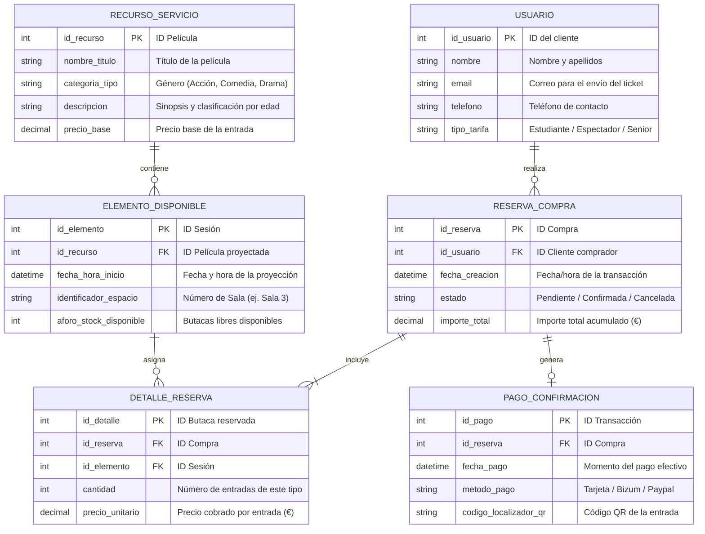

# Modelo de Base de Datos Genérico adaptado a la aplicación de cine(ERD)

```mermaid
erDiagram
    USUARIO ||--o{ RESERVA_COMPRA : "realiza"
    RECURSO_SERVICIO ||--o{ ELEMENTO_DISPONIBLE : "contiene"
    ELEMENTO_DISPONIBLE ||--o{ DETALLE_RESERVA : "asigna"
    RESERVA_COMPRA ||--|{ DETALLE_RESERVA : "incluye"
    RESERVA_COMPRA ||--o| PAGO_CONFIRMACION : "genera"

    USUARIO {
        int id_usuario PK "ID del cliente"
        string nombre "Nombre y apellidos"
        string email "Correo para el envío del ticket"
        string telefono "Teléfono de contacto"
        string tipo_tarifa "Estudiante / Espectador / Senior"
    }

    RECURSO_SERVICIO {
        int id_recurso PK "ID Película"
        string nombre_titulo "Título de la película"
        string categoria_tipo "Género (Acción, Comedia, Drama)"
        string descripcion "Sinopsis y clasificación por edad"
        decimal precio_base "Precio base de la entrada"
    }

    ELEMENTO_DISPONIBLE {
        int id_elemento PK "ID Sesión"
        int id_recurso FK "ID Película proyectada"
        datetime fecha_hora_inicio "Fecha y hora de la proyección"
        string identificador_espacio "Número de Sala (ej. Sala 3)"
        int aforo_stock_disponible "Butacas libres disponibles"
    }

    RESERVA_COMPRA {
        int id_reserva PK "ID Compra"
        int id_usuario FK "ID Cliente comprador"
        datetime fecha_creacion "Fecha/hora de la transacción"
        string estado "Pendiente / Confirmada / Cancelada"
        decimal importe_total "Importe total acumulado (€)"
    }

    DETALLE_RESERVA {
        int id_detalle PK "ID Butaca reservada"
        int id_reserva FK "ID Compra"
        int id_elemento FK "ID Sesión"
        int cantidad "Número de entradas de este tipo"
        decimal precio_unitario "Precio cobrado por entrada (€)"
    }

    PAGO_CONFIRMACION {
        int id_pago PK "ID Transacción"
        int id_reserva FK "ID Compra"
        datetime fecha_pago "Momento del pago efectivo"
        string metodo_pago "Tarjeta / Bizum / Paypal"
        string codigo_localizador_qr "Código QR de la entrada"
    }
```