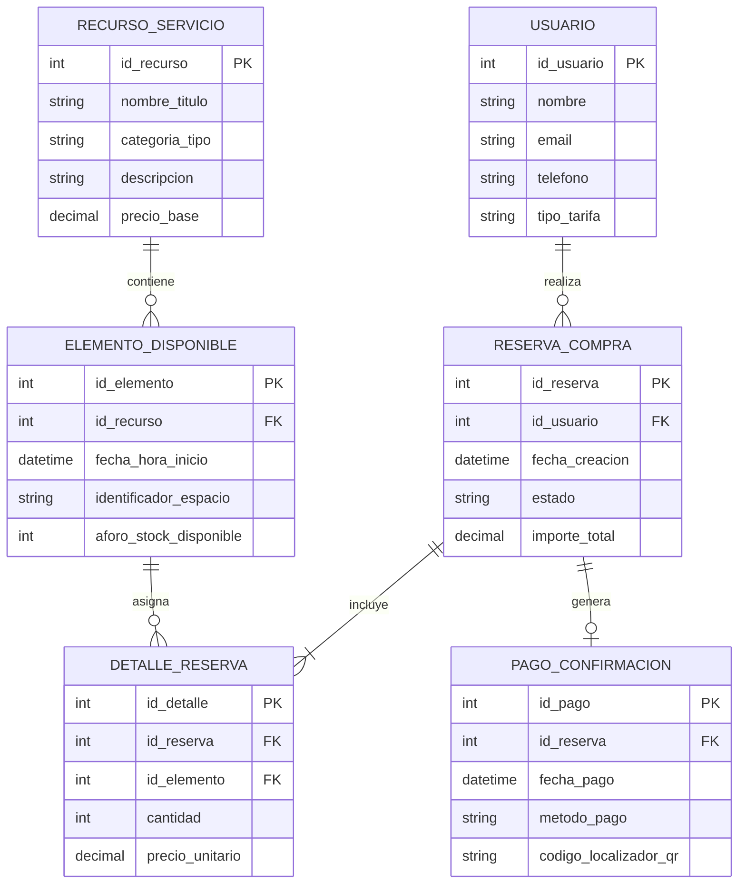

# Modelo de Base de Datos Genérico (ERD)

A continuación se muestra la estructura relacional única para el proyecto:

```mermaid
erDiagram
    USUARIO ||--o{ RESERVA_COMPRA : "realiza"
    RECURSO_SERVICIO ||--o{ ELEMENTO_DISPONIBLE : "contiene"
    ELEMENTO_DISPONIBLE ||--o{ DETALLE_RESERVA : "asigna"
    RESERVA_COMPRA ||--|{ DETALLE_RESERVA : "incluye"
    RESERVA_COMPRA ||--o| PAGO_CONFIRMACION : "genera"

    USUARIO {
        int id_usuario PK
        string nombre
        string email
        string telefono
        string tipo_tarifa
    }

    RECURSO_SERVICIO {
        int id_recurso PK
        string nombre_titulo
        string categoria_tipo
        string descripcion
        decimal precio_base
    }

    ELEMENTO_DISPONIBLE {
        int id_elemento PK
        int id_recurso FK
        datetime fecha_hora_inicio
        string identificador_espacio
        int aforo_stock_disponible
    }

    RESERVA_COMPRA {
        int id_reserva PK
        int id_usuario FK
        datetime fecha_creacion
        string estado
        decimal importe_total
    }

    DETALLE_RESERVA {
        int id_detalle PK
        int id_reserva FK
        int id_elemento FK
        int cantidad
        decimal precio_unitario
    }

    PAGO_CONFIRMACION {
        int id_pago PK
        int id_reserva FK
        datetime fecha_pago
        string metodo_pago
        string codigo_localizador_qr
    }
```